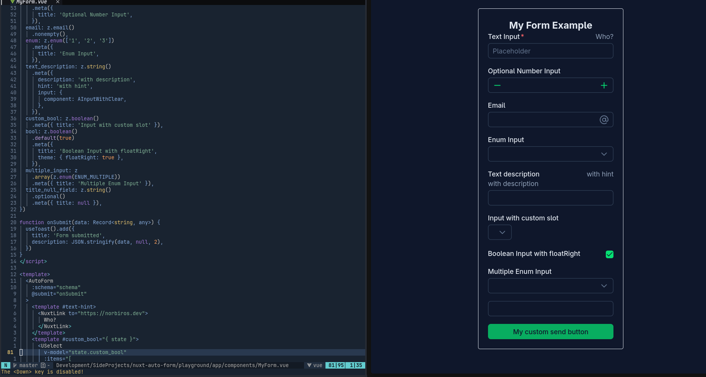

# Nuxt Auto Form

[![npm version][npm-version-src]][npm-version-href]
[![License][license-src]][license-href]
[![Nuxt][nuxt-src]][nuxt-href]

A Nuxt module for generating [Nuxt UI](https://ui.nuxt.com) forms from Zod 4 schemas.

> [!WARNING]
> Nuxt Auto Form is currently in beta. APIs may change between releases.

* [Release notes](/CHANGELOG.md)
* [Documentation](https://nuxt-auto-form.norbiros.dev)
* [StackBlitz playground](https://stackblitz.com/github/Norbiros/nuxt-auto-form/tree/master/playground?file=app%2Fcomponents%2FMyForm.vue)



## Features

* Generates form fields from Zod schemas
* Uses Zod for validation and type inference
* Renders fields using Nuxt UI components
* Supports inputs, selects, checkboxes, and other field types
* Allows individual fields, inputs, and buttons to be customized

## Installation

Add the module to your Nuxt project:

```bash
npx nuxi module add @norbiros/nuxt-auto-form
```

The module will be added to your Nuxt configuration automatically.

See the [documentation](https://nuxt-auto-form.norbiros.dev) for configuration and usage examples.

## Development

Install the dependencies:

```bash
pnpm install
```

Generate the type stubs:

```bash
pnpm dev:prepare
```

Start the playground:

```bash
pnpm dev
```

Start the documentation site:

```bash
pnpm docs:dev
```

Run ESLint:

```bash
pnpm lint
pnpm lint:fix
```

Run the end-to-end tests:

```bash
pnpm e2e
```

Create a new release:

```bash
pnpm run release
```

## Contributing

Bug reports, feature requests, and pull requests are welcome.

## License

Licensed under the [MIT License](./LICENCE).

<!-- Badges -->

[npm-version-src]: https://img.shields.io/npm/v/@norbiros/nuxt-auto-form/latest.svg?style=flat&colorA=18181B&colorB=28CF8D
[npm-version-href]: https://npmjs.com/package/@norbiros/nuxt-auto-form
[license-src]: https://img.shields.io/npm/l/@norbiros/nuxt-auto-form.svg?style=flat&colorA=18181B&colorB=28CF8D
[license-href]: https://npmjs.com/package/@norbiros/nuxt-auto-form
[nuxt-src]: https://img.shields.io/badge/Nuxt-18181B?logo=nuxt.js
[nuxt-href]: https://nuxt.com
